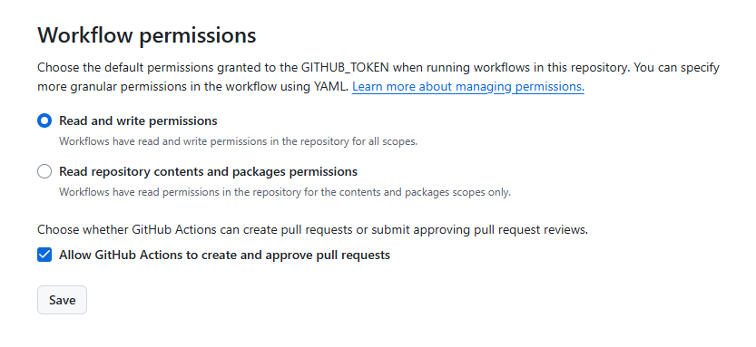

# GitHub自动提交保持状态常绿

## 1.拉取仓库

**⚠️ 千万不要 Fork，因为 fork 项目的动态并不会让你变绿 ⚠️**

```
https://github.com/43907800/auto-green
```

## 2.修改 `ci.yml` 文件

- 修改 ci.yml 文件的第 8 行调整频率定时
- 修改 ci.yml 文件的第 19、20 行为自己的Git账号和昵称信息

## 3.设置Actions权限

- **Actions执行失败是因为工作流权限不够**

```
Settings -> Actions -> General
# 找到 Workflow permissions
    # 勾选 Read and write permissions
    # 勾选 Allow GitHub Actions to create and approve pull requests
```


