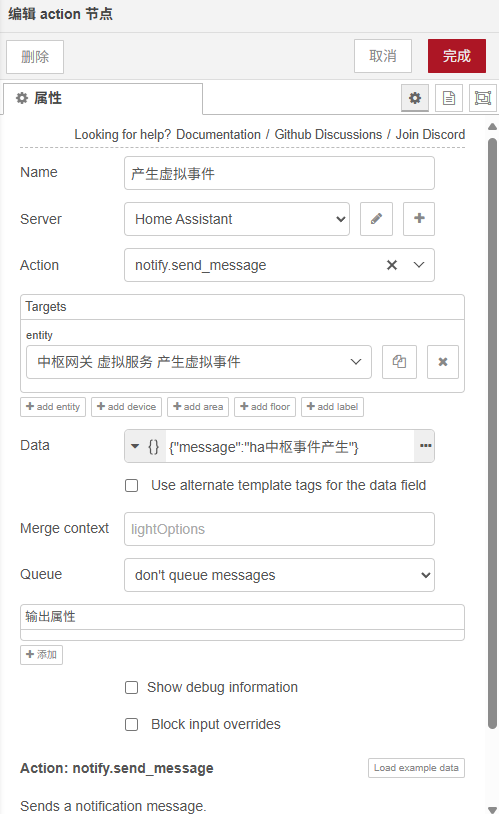

# Node-Red的HA节点使用说明

## 节点管理

- node-red-contrib-home-assistant-websocket  # home-assistant
- node-red-node-ping   # ping 命令
- node-red-contrib-cron-plus  # cron定时
- node-red-contrib-flow-manager  # 将flows.json(流程)分离为多个文件

## 节点使用

**右侧调试按钮旁边有帮助,可查看每个节点的明细说明**

- 向米家中枢产生虚拟事件

  - 示例

    

  - 导入:更改实体id,data中message为虚拟事件名称

    ```json
    [
        {
            "id": "f2bacf90858acf79",
            "type": "api-call-service",
            "z": "1de7721b40147778",
            "name": "产生虚拟事件",
            "server": "dbfb788ffb1f13f6",
            "version": 7,
            "debugenabled": false,
            "action": "notify.send_message",
            "floorId": [],
            "areaId": [],
            "deviceId": [],
            "entityId": [
                "notify.xiaomi_cn_1079853347_hub1_emit_virtual_event_a_4_1"
            ],
            "labelId": [],
            "data": "{\"message\":\"ha中枢事件产生\"}",
            "dataType": "json",
            "mergeContext": "",
            "mustacheAltTags": false,
            "outputProperties": [],
            "queue": "none",
            "blockInputOverrides": false,
            "domain": "notify",
            "service": "send_message",
            "x": 440,
            "y": 500,
            "wires": [
                []
            ]
        }
    ]
    ```

